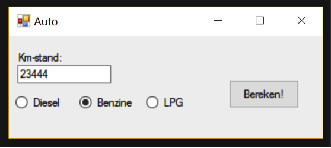

<table style="border: solid thin"><tr><th>Niveau</th>
<td>2 of 5</td>
</tr>
<tr><th>Leerdoelen</th>
<td>Class, property.</td>
</tr>
<tr><th>Vereiste voorkennis</th>
<td>Basiskennis over objecten.</td>
</tr>
<tr><th>Challenge Type</th>
<td>Realiseren.</td>
</tr>
</table>

Je bent als software engineer ingehuurd om een tool te programmeren waarmee de dagwaarde van auto’s kan worden bepaald.
De dagwaarde van een auto wordt berekend met deze formule:
(500000/KM) * factor
Hierbij is KM de kilometerstand van de auto. Factor is een waarde die afhankelijk is van het brandstoftype:
- Factor = 100 indien het een benzine-auto is
- Factor = 150 indien het een dieselauto is.
- Factor = 90 indien het een LPG-auto is.
De user interface bestaat minimaal uit 3 radio buttons, een textbox en een knop (button) om de berekende dagwaarde te tonen.

##### Technische randvoorwaarden
De volgende technische requirements zijn van toepassing:
- Er dient een klasse Auto geprogrammeerd te worden met property’s KmStand en Brandstofsoort.
- De klasse Auto dien ook een read-only property Dagwaarde te hebben
- Het form maakt gebruik van deze klasse: er staat geen code die berekeningen uitvoert in het form.
