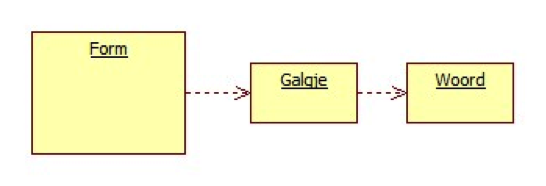

<table style="border: solid thin"><tr><th>Leerdoelen</th>
<td>Constructor, read file, private, class diagram.</td>
</tr>
<tr><th>Extra</th>
<td>Algoritme,</td>
</tr>
<tr><th>Vereiste voorkennis</th>
<td>Class, object.</td>
</tr>
<tr><th>Challenge Type</th>
<td>Programming.</td>
</tr>
</table>

Galgje
Maak het spel galgje waarbij je als gebruiker tegen de computer een woord moet raden. Technische en functionele eisen:
1. Programmeer de klasse Woord die het te raden woord bevat. Programmeer bijvoorbeeld een conctructor Woord(string w).
2. Lees het te raden woord in uit een tekstbestand en maak vervolgens in C# een Woord-object aan.
3. Programmeer de klasse Galgje die onder meer een veld van het type Woord heeft.
4. Zorg ervoor dat het form alleen een dataveld van het type Galgje heeft, het form heeft GEEN dataveld van het type Woord.

