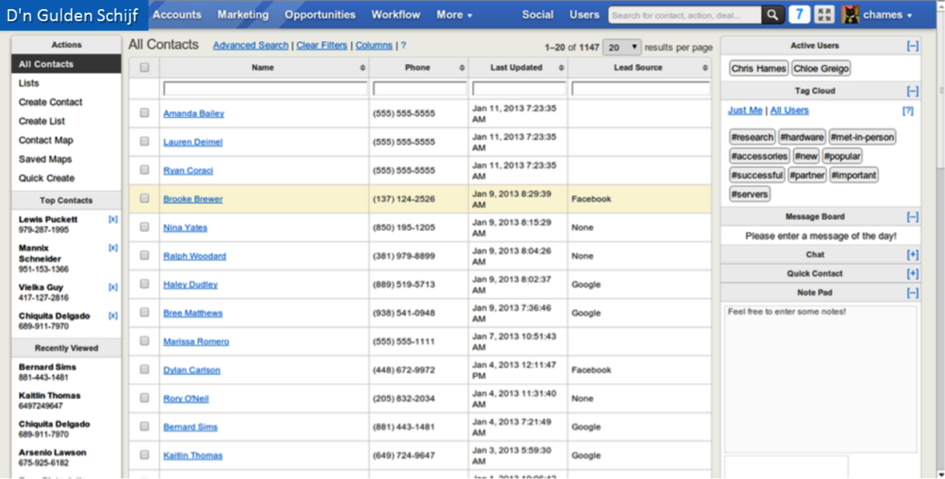

<table style="border: solid thin"><tr><th>Leerdoelen</th>
<td>Class.</td>
</tr>
<tr><th>Vereiste voorkennis</th>
<td>Basiskennis over objecten.</td>
</tr>
<tr><th>Challenge Type</th>
<td>Technisch ontwerp.</td>
</tr>
<tr><th>Extra</th>
<td>Realiseren van het ontwerp.</td>
</tr>
</table>

Platenmaatschappij D'n Gulden Schijf wil een applicatie ontwikkelen om hun contactpersonen in een database bij te houden.
De contactpersonen van de maatschappij bestaan uit artiesten, bands, managers en ook uit leveranciers die bijvoorbeeld kantoorartikelen en grondstoffen voor het bedrijf leveren.
Van elke artiest of band moet naast de gebruikelijke naam-en-adres-gegevens ook worden bijgehouden welke platen (songs) ze hebben uitgebracht. Elke song bestaat uit een titel, het jaar van uitgave en een tijdsduur (in minuten + seconden). Als je in het systeem door songs bladert dan kun je elke song aanklikken om af te spelen. Hij speelt dan een hoge kwaliteit-MP3 af van die song.
Zoekfunctie: binnen het systeem moet kunnen worden gezocht op naam van band, manager, leverancier of naam van artiest.
Bij de gegevens van de managers moet worden bijgehouden wat hun uurtarief (in euro) is.
Als een contactpersoon een leverancier is dan staat er naast de naam+adresgegevens ook bij wat de gemiddelde levertijd (tijd in dagen) is van de producten van die leverancier.
Bij een band moet ook nog worden opgeslagen of er een speciaal instrument bij zit (ja/nee-veld). Speciale instrumenten zijn alle instrumenten die niet gelijk zijn aan drums, keyboard, basgitaar en gitaar. Voorbeelden van speciale instrumenten zijn bijvoorbeeld een dwarsfluit, harp, enz.
Het systeem moet worden beveiligd middels een user+wachtwoord-systeem. Users (gebruikers) kunnen zich aanmelden met een gebruikersnaam en wachtwoord waarna ze toegang hebben tot alle gegevens in het systeem.

