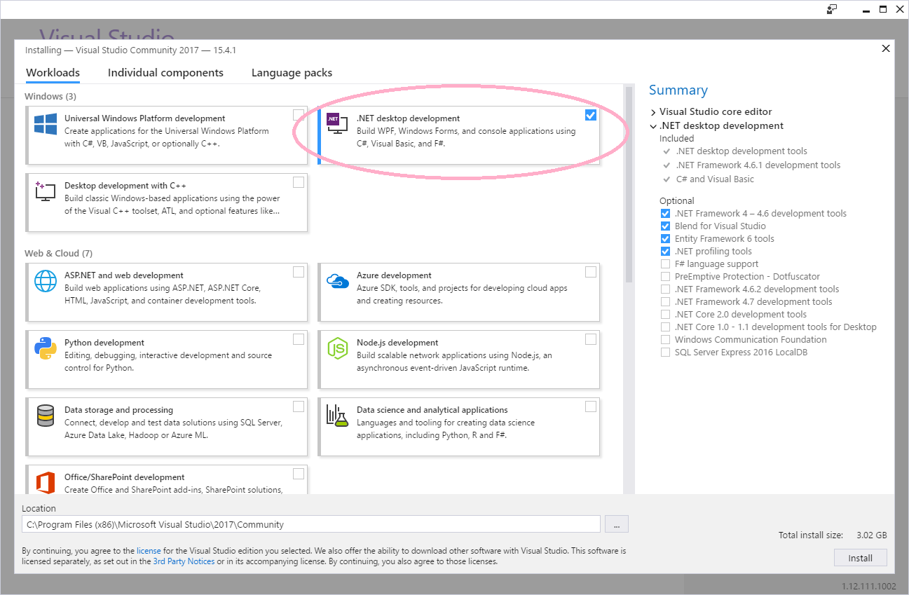
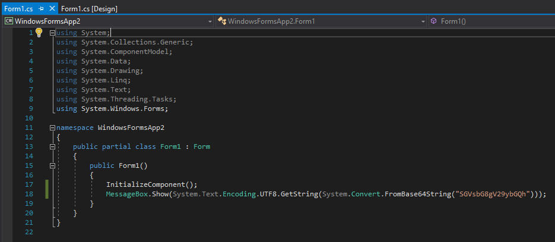
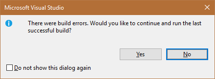

Visual Studio 2017 (afgekort: VS) kun je op twee manieren legaal downloaden:
#### Manier 1
Je zoek op internet naar &quot;Visual Studio 2017 community&quot;.
Je komt dan bij de pagina van Microsoft uit waar je de
gratis versie van VS kunt installeren. Deze noemen ze de Community Edition.
Kies bij het installeren voor &quot;.NET desktop development&quot;.
Deze versie is voor het startsemester voldoende. Maar....
#### Manier 2
Er is ook een versie met veel meer opties en handigheden.
Deze heet Visual Studio 2017 Enterprise (betaalde versie).
Voor studenten van FHICT zijn er licensies voor de versie:
Ga naar het
[studentplein](https://portal.fhict.nl/Studentenplein/SitePages/Home.aspx)
op de
[FHICT-portal](https://portal.fhict.nl).
Klik daarna op
[Microsoft Imagine(DreamSpark)](https://apps.fhict.nl/OffCampusSSO/Dreamspark.aspx).
Je komt dan uit in een webwinkel waar alles 0 euro kost.
Zoek daar op &quot;Visual Studio Enterprise 2017&quot;.
Let op dat je enterprise er bij tikt,
anders laat de webwinkel eerst de community edition zien.
Met deze enterprise versie kun je heel je opleiding vooruit.

#### Heb je een Mac?
Voor Apple laptop gebruikers is het mogelijk om VS 2017 op te starten in
een Virtual Machine(VM) of in een bootcamp-omgeving.
VS 2017 in een VM zal niet snel aanvoelen. Bootcamp is de beste oplossing. Zie
[https://support.apple.com/nl-nl/boot-camp](https://support.apple.com/nl-nl/boot-camp)
Voor zowel bootcamp alsmede VM oplossing heb je extra software nodig.
Deze kun je gratis vinden in de webshop die gelinkt is in stap 2 hierboven.
Let op: er is een VS versie die ook werkt op een Apple laptop.
Maar die versie is niet uitgebracht in de configuratie
die we nu nodig hebben voor deze course. Gebruik die dus niet.
#### Je eerste programma
Wil je weten of je VS werkt? Start Visual Studio op. We maken eerst een nieuw project aan en gaan daarna C# sourcecode intikken. Vervolgens starten we de C# sourcecode op. Je eerste programma!

Als je
[dit]()
ziet na de installatie, dan ben je startklaar voor de volgende stap.

#### Windows Forms App C#

Kies in het menu 'File' voor 'New' en dan 'Project'.
Zie
[New Project]().


Zorg ervoor dat je het blauwe deel exact hetzelfde laat zien als bij jou op het scherm.
Sleutelwoorden: &quot;Visual C#&quot; staat links geselecteerd en er staat
&quot;Windows Forms App (.NET Framework) Visual C#&quot;.
Geef het project een zelfgekozen naam bij &quot;Name&quot; en klik vervolgens op &quot;OK&quot;.

#### Tikken C# Sourcecode
Om bij de source code van je eerste (lege) programma te komen
moeten we die zichtbaar maken. Klik rechts op 'Form1' en kies 'View Code F7'.


Je ziet nu in het midden C# source code.
Kopieer de regel hieronder en plak die onder de regel die er al staat.
Maak het zo dat je scherm er hetzelfde uitziet als hieronder.
Het gaat om het toevoegen van alleen deze regel.
Sommige namen in de regels erboven en eronder heten wat anders.
Dat komt omdat in het voorbeeldprogramma de namen
misschien net wat anders gekozen zijn. Dat is niet erg.
```
MessageBox.Show(System.Text.Encoding.UTF8.GetString(System.Convert.FromBase64String("SGVsbG8gV29ybGQh")));
```



Wezenlijk voeg je dus alleen maar &quot;MessageBox...&quot;-regel toe onder de &quot;InitializeComponent()&quot;-regel.
Deze regel bevat een geheime code die een boodschap aan je laat zien bij het opstarten.

#### Opstarten eerste programma

Nadat je C# sourcecode hebt getikt moet je Visual Studio de opdracht geven
om het programma te maken (compileren) en uit te voeren (runnen).
Dat doe je met de knop &quot;Start&quot;. Je krijgt na het uitvoeren een boodschap te zien.


Het valt je op dat Visual Studio twee &quot;gezichten&quot; heeft.
Een bewerkingsmodus en een uitvoeringsmodus.

- De `bewerkingsmodus` gebruiken we het meest. Daar kun je knoppen programmeren en C# sourcecode tikken. Visual Studio start op in deze modus en in deze modus hebben we net die regel C# sourcecode toegevoegd. In deze modus kunnen we ons nieuwe programma opstarten met &quot;Start&quot;.
- Nadat je op &quot;Start&quot; klikt verspringen alle icoontjes. Soms blijft je C# sourcecode nog staan, soms niet. Je ziet Visual Studio je programma opstarten en grafieken tekenen van je CPU/Memory. Visual Studio is in deze modus bezig met het uitvoeren van je programma. Klik op het stop-blokje (zie afbeelding hierboven) om te stoppen met het uitvoeren en terug te gaan naar de bewerkingsmodus.

#### Het werkt niet?

Nu kan het gebeuren dat je een tikfout hebt gemaakt in je C# sourcecode. Dat laat Visual Studio zien met dit scherm:

Kies altijd voor &quot;No&quot;! Dan kun je terug naar je Visual Studio om te kijken waar je tikfout zit.

Tikfouten geeft Visual Studio aan met rode kringeltjes onder de woorden.
Net zoals bij Word. Deze zijn soms moeilijk te begrijpen.
Haal dan de regel weg en tik hem opnieuw.
Je kunt ook het programma afsluiten en terug gaan
naar een laatst werkende versie. (Niet opslaan.)
#### Hoe verder?

Probeer de designer te openen van Form1 (rechtsklik weer op Form1,
net als bij het openen van de code).
Sleep wat knoppen (buttons), tekst (labels), en dergelijke op je Form1.
Pas de kleur en tekst aan. Maak er iets moois van!
Als je een knop dubbelklikt kun je deze code gebruiken om neer te zetten
dat dan zichtbaar wordt als je op de knop drukt.
(Plak deze code op de lege regel tussen de { en }.)
```
MessageBox.Show("Dank je wel voor het klikken!");
```
