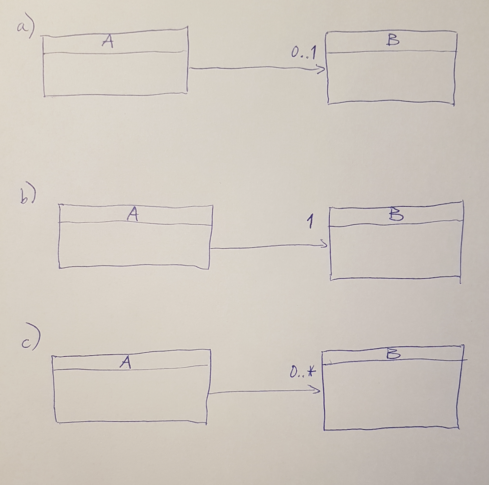

Al eerder heb je `class diagrams` gezien:
*plaatjes waarin classes als rechthoeken worden getoond*.

In figuur
[](#fig:ClassAenB)
zie je steeds twee `classes`, *A* en *B*.
De relatie tussen *A* en *B* is steeds anders:
De pijl geeft een relatie aan tussen de `classes`,
inclusief richting (`class` *A* kent `class` *B*).
We gaan nu kijken hoe die relaties naar C#-code vertaald kunnen worden:


Mogelijk bij (a) behorende C#-code```
pubic class A {

	// Fields
	private B b;

}
```
Hierbij *kent* `class` *A* `class` *B*.
Het `Field` krijgt vaak de naam van de `class` maar dan beginnend met kleine letter.
De waarde van *b* kan
`null` zijn of een object van type *B*.


In situatie (b)```
pubic class A {

	// Fields
	private B b = new B();

}
```
Hierbij *kent* `class` *A* `class` *B*.
De waarde van *b* wordt direct ingevuld, deze zal dus niet `null` zijn.


Bij (c) behorende C#-code:```
pubic class A {

	// Fields
	private List<B> bs = new List<B>();

}
```
Een `object` van `type` A kent 0 of meer (vanwege de `0..*`)
objecten van `type` B.
Voor de naam van het `Field` (hier *bs*)
wordt doorgaans het meervoud gekozen van *b*. Stel dus bijvoorbeeld dat `class` *B*
niet *B* zou heten maar *BattleRager*, dan zou het Field *b* in plaats daarvan
*battleRager* heten en het Field *bs* zou *battleRagers* worden.

Merk op dat in plaats van een `List` ook een `Array` gebruikt kan worden.
